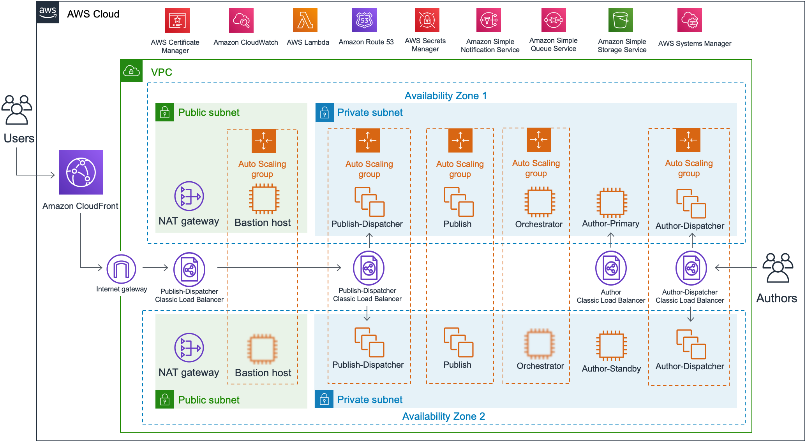

Deploying this Quick Start for a new virtual private cloud (VPC) with
*default parameters* builds the following _{partner-product-name}_ environment in the
AWS Cloud.

// Replace this example diagram with your own. Send us your source PowerPoint file. Be sure to follow our guidelines here : http://(we should include these points on our contributors guide)
:xrefstyle: short
[#architecture1]
.Quick Start architecture for _{partner-product-name}_ on AWS
[link=images/architecture_diagram.png]
image::../images/architecture_diagram.png[Architecture,width=648,height=439]

[#architecture2]
.Quick Start architecture of resources for _{partner-product-name}_ on AWS
[link=images/architecture_diagram_2.png]

As shown in <<architecture1>> and <<architecture2>>, the Quick Start sets up the following:

* A highly available architecture that spans two Availability Zones.*
* A VPC configured with public and private subnets, according to AWS
best practices, to provide you with your own virtual network on AWS.*
* Amazon Cloudfront for content delivery.
* In the public subnets:
** Managed network address translation (NAT) gateways to allow outbound
internet access for resources in the private subnets.*
** A Linux bastion host in an Auto Scaling group to allow inbound Secure
Shell (SSH) access to EC2 instances in public and private subnets.*
** An internet-facing Classic Load Balancer (ELB) for routing traffic to the instances for content delivery.
* In the private subnets:
** An internal ELB for content management web server.
** An internal ELB for content management.
** Content management EC2 instances are designed for active/passive standby and are not part of an Auto Scaling Group.
** All other EC2 instances are deployed into their own Auto Scaling group.
* EC2 Amazon Machine Image (AMI) for each AEM OpenCloud role.
* AWS Systems Manager to store parameter data.
* Amazon Simple Storage Service (Amazon S3) artifacts bucket for storing static data.
* Amazon CloudWatch for monitoring deployed services.
* AWS Secrets Manager for the AEM Keystore Password & private key of the self-signed certificate.
* AWS Certificate Manager (ACM) for access control.
* A Lambda function to Generate and import the self-signed certificate into ACM.
* A Lambda function to request an external certificate in ACM.
* SNS Topics & SQS Queues.
* Amazon Route 53 private hosted zone for internal Domain Name System (DNS) lookups within the VPC.

*The template that deploys the Quick Start into an existing VPC skips
the components marked by asterisks and prompts you for your existing VPC
configuration.
